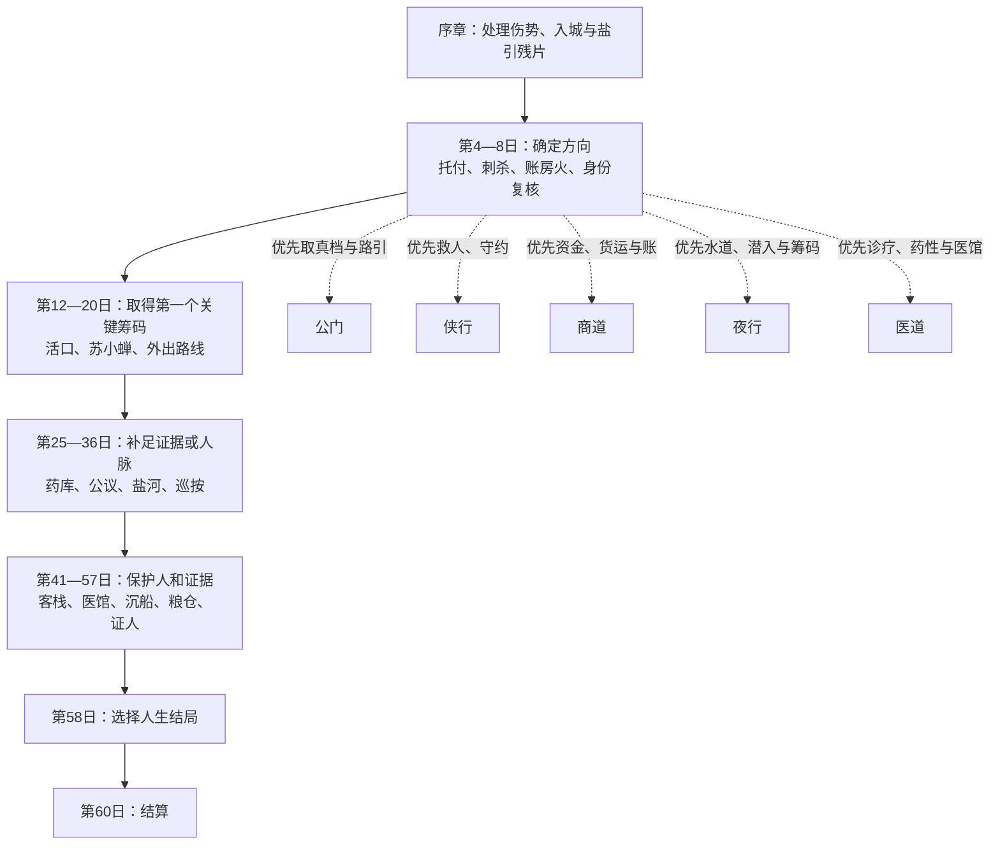

# 《青石江湖》六十日真人试玩路线图

> 适用范围：当前 `campaign-content.ts` 已实装的 19 个锚点事件与五条人生路线。
>
> 这不是全剧透攻略。它解决的是第一次真人游玩时“选项很多，却不知道自己正朝哪里走”的问题：先选一个想要的结局方向，再在每个锚点选择与它一致的行动。错过单个事件不会直接失败；第 60 日才会结算此生。

## 先看这张图

## 游玩前只做一个决定

不要把每个选项都当作必须拿到的内容。第一次游玩时，请从下列五个意图中选一个，把它当成自己的主角目标。

| 想体验什么 | 选哪条路线 | 核心感受 | 第一次推荐度 |
|---|---|---|---|
| 用程序和证据查清盐案 | 公门 | 补身份、收真档、公开核验 | **最高** |
| 先救人，再承受后果 | 侠行 | 守约、救援、结盟 | 高 |
| 靠货运和账目站稳脚跟 | 商道 | 周转、交易、建立转运行 | 中 |
| 用风险换信息和退路 | 夜行 | 潜入、水道、减轻追查 | 中 |
| 从伤毒和药材追到真相 | 医道 | 治疗、检验、保护病人 | 中 |

**第一次建议走公门。** 这条线的方向最直观：先把“我是谁”办清，再取得县衙真档，之后把证据送进公开程序。它能让玩家最快理解盐案、县衙和许惟谦之间的关系。

## 所有路线都适用的四条规则

1. **事件出现后优先前往。** 每个锚点只会在下一锚点到来前开放；选择“暂离现场”或等待太久，会得到缺席结果。缺席不是死档，但会少一个容易取得的筹码。
2. **一条线连续做至少四次。** 第 58 日选择人生结局前，路线需要至少四次对应实践。不要前半段每项都点一次，后半段才想决定走向。
3. **钱是路线资源，不是万能分。** 商道要留钱；公门和侠行可用多数不花钱选项；医道也可用医馆杂活和治疗维持。钱不够时，优先接与主路线一致的每日差事。
4. **先看选项前置条件。** 灰掉或未出现的选择通常在提示中写明缺什么：银两、路引、证据、关系或先前旗标。先补前置，不需要反复读档猜测。

## 五条可直接照着走的路线

下面列出的不是唯一正确答案，而是“第一次游玩最容易保持方向”的一组选择。括号内是此选择给出的关键结果。

### A. 公门：让盐案进入可核验的程序

**第 58 日资格：** 公门实践至少 4 次、持有路引、追查低于 4、持有“县衙真档副本”。

| 日数 | 事件 | 推荐选择 | 目的 |
|---|---|---|---|
| 5 | 廊下的第二声弦 | 示警并合力落下廊门 | 保住顾清河，取得公门实践 |
| 7 | 火里只够走一次 | 帮官差截住纵火者 | 取得漕运线索，继续公门实践 |
| 8 | 封城后的姓名 | 交代旧口供差异，申请补验路引 | **取得路引**、降低追查 |
| 12 | 活人的价 | 凭验过的身份请差役公开验人 | 有路引后可救出活口，取得证言 |
| 20 | 县城以外 | 往邻府递状，查官盐底档 | **取得县衙真档副本** |
| 36 | 巡按只要一页纸 | 交真档副本，要求留原始收据 | 把真档放进正式程序，降低追查 |
| 53 | 谁来开粮仓 | 把仓钥交公账保管 | 补足公门实践与民间秩序 |
| 55 | 三份账之间 | 查公示档号，补真档副本 | 最终补证，适合前面遗漏时救场 |

**一句话目标：** 第 20 日拿到真档后，不要把它卖掉或只藏着；第 36 日把它正式交出去。

### B. 侠行：先让该活的人活下来

**第 58 日资格：** 侠行实践至少 4 次，且已完成“山门公议问责”或“乡民互保”。

| 日数 | 事件 | 推荐选择 | 目的 |
|---|---|---|---|
| 4 | 破庙一灯 | 留下照料，把追兵引向空路 | 守住岳寒声，取得遗嘱 |
| 5 | 廊下的第二声弦 | 带书吏避入石阶，让捕头护县令 | 保人并保住顾清河 |
| 6 | 没有人坐的椅子 | 出示实际持有的遗嘱 | 让陆观澜愿意作证 |
| 7 | 火里只够走一次 | 砸开后窗，把账房拖出来 | 救人并得到运输账 |
| 12 | 活人的价 | 用三日护送劳力换他自由 | 不花钱救活口并得到证言 |
| 16 | 茶凉以前 | 随脚夫换班，把苏小蝉护送出盐场 | 保住苏晚棠最在意的人 |
| 28 | 山门公议 | 让门人核对遗嘱与掌门笔迹 | **完成公议问责** |
| 53 | 谁来开粮仓 | 组织乡民互保，把粮送进各巷 | 前面错过公议时的资格替代 |

**一句话目标：** 每次在“救人”和“抢证据”之间犹豫时先救人；后续的人情会补回不少线索。

### C. 商道：用公开的交易站稳脚跟

**第 58 日资格：** 商道实践至少 4 次、建立“平价转运行”、身上至少 12 两银子。

| 日数 | 事件 | 推荐选择 | 目的 |
|---|---|---|---|
| 6 | 没有人坐的椅子 | 垫三两备路粮，按本钱赊给门人 | 建立商道路数与陆观澜关系 |
| 7 | 火里只够走一次 | 召脚夫保住码头粮货 | **获得 8 两**，保住货运能力 |
| 8 | 封城后的姓名 | 交五两押金，以商旅名簿担保 | 合法接运普通货物 |
| 20 | 县城以外 | 沿河押货，用实货核对税重 | **获得 10 两与运输账** |
| 32 | 盐河断索 | 付六两雇船接走伤员，换账 | 花钱换运输账与河道人情 |
| 49 | 一船黑水 | 花十两雇拖船，把人货一起扣在浅滩 | 保住河道，代价很高，钱不够就跳过 |
| 53 | 谁来开粮仓 | 垫八两开平价转运行 | **建立转运行，资格关键** |
| 56 | 不落款的开价 | 接下最后一趟粮运，实做实结 | 回收 6 两，冲刺 12 两结局资金 |

**一句话目标：** 前期先挣钱，不要在第 16、32、49、53 日的所有付费选项上同时花钱；第 53 日之前务必留足 8 两，结局前再补到 12 两。

### D. 夜行：留一条没人知道的退路

**第 58 日资格：** 夜行实践至少 4 次、掌握水道门路、持有至少两类证据。

| 日数 | 事件 | 推荐选择 | 目的 |
|---|---|---|---|
| 4 | 破庙一灯 | 趁他昏睡取走遗嘱，留下水囊 | 取得第一类筹码，但提高风险 |
| 5 | 廊下的第二声弦 | 趁乱抄下真档 | 取得县衙真档，追查上升 |
| 7 | 火里只够走一次 | 从近门抢出运输账 | 取得第二类证据 |
| 8 | 封城后的姓名 | 避开复核，记下换岗水道 | **取得水道门路** |
| 12 | 活人的价 | 借送饭机会把门闩松开 | 取得证言，追查上升 |
| 20 | 县城以外 | 借北山旧道，换取药栈留底 | 可补药库记录与水道资源 |
| 36 | 巡按只要一页纸 | 交出夜行路线，请求减免追查 | 降低追查，减少后期压力 |
| 57 | 最后一盏灯 | 启用已经安排的落脚处 | 回收此前的水道与藏身关系 |

**一句话目标：** 夜行不是“每次都选最狠的选项”；先拿两类证据和水道，再在第 36 或第 56 日处理追查。

### E. 医道：从伤口查到药库

**第 58 日资格：** 医道实践至少 4 次、持有“药库出入记录”、完成至少一次医术研习。

| 日数 | 事件 | 推荐选择 | 目的 |
|---|---|---|---|
| 序章 | 医馆 | 接受诊疗并保留病案信息 | 先让伤毒不拖垮后续行动 |
| 4 | 破庙一灯 | 花四两请医者出诊 | 取得药库记录，保护岳寒声 |
| 5 | 廊下的第二声弦 | 留在门外救治被踩伤的人 | 医道实践，代价是县令无法获救 |
| 25 | 空药库 | 协助核对残渣与药签 | 医道实践，稳固药库记录 |
| 日常 | 可用行动 | 帮医馆分药照料病人；满足阅历后研习医道 | **完成一次医术研习** |
| 45 | 名单上的灯 | 付钱分路转移，或公开递报保护名单 | 保住沈砚秋与病案 |
| 49 | 一船黑水 | 召差役封住引水口，再救人 | 保住河道并补药物证据 |
| 55 | 三份账之间 | 从废栈与药农手中补药库签押 | 前期遗漏时的补证节点 |

**一句话目标：** 医道的关键不是只选“救人”，而是要在日常行动中实际完成一次“研习医道”；没有这一步，第 58 日不能选医道结局。

## 19 个锚点事件：什么时候该做什么

| 日数 | 事件 | 第一次游玩时的判断方法 |
|---|---|---|
| 4 | 破庙一灯 | 拿遗嘱走侠行；拿药库记录走医道；偷取走夜行。 |
| 5 | 廊下的第二声弦 | 保县令走公门/侠行；抄真档走夜行。 |
| 6 | 没有人坐的椅子 | 遗嘱交陆观澜走侠行；登记作证走公门；垫粮走商道。 |
| 7 | 火里只够走一次 | 救人走侠行；抢账走夜行；保货挣钱走商道；截凶走公门。 |
| 8 | 封城后的姓名 | 补路引走公门；押金担保走商道；水道走夜行。 |
| 12 | 活人的价 | 活口即证言：按你的路线选赎、护送、公开验人或夜救。 |
| 16 | 茶凉以前 | 苏小蝉安全通常会让苏晚棠的后续帮助更可靠。 |
| 20 | 县城以外 | 这是最明确的“补哪类证据”节点：北山/夜道拿药库，河道拿运输，邻府拿真档。 |
| 25 | 空药库 | 医道补药库；商道可花钱买留底；夜行用风险取焦纸。 |
| 28 | 山门公议 | 有遗嘱就核笔迹，有药库记录就对签；都没有则护送人下山。 |
| 32 | 盐河断索 | 要运输账选交易/潜入；要证言选救民船。 |
| 36 | 巡按只要一页纸 | 有真档或证言就正式递交；夜行可在这里减追查。 |
| 41 | 掌柜的最后一本账 | 已救小蝉可核货签；否则先保客栈或建立水道掩护。 |
| 45 | 名单上的灯 | 优先保住沈砚秋；药库线和医道线尤其不要错过。 |
| 49 | 一船黑水 | 钱足保人货；公门封水；侠行救人；夜行换清单。 |
| 53 | 谁来开粮仓 | 侠行拿乡民互保，商道建立转运行，公门取得公共责任。 |
| 55 | 三份账之间 | 缺哪份就补哪份：真档、运输账、药库记录或证言。 |
| 56 | 不落款的开价 | 这是整理立场、补钱或消追查的最后窗口。 |
| 57 | 最后一盏灯 | 用之前建立的安全屋、陆观澜关系、钱或公开程序保住证人。 |

## 第 55 日的自检清单

到这里不要只看“剧情是否精彩”，请打开角色与记录，核对这五件事：

- 我已做够四次哪一条路线？
- 若要走公门，是否有路引、真档且追查低于 4？
- 若要走商道，是否已经建立转运行，并留有 12 两？
- 若要走夜行，是否有水道和至少两类证据？
- 若要走医道，是否真的研习过一次医道？

若不满足，不需要推倒重来：第 55 日能补一类证据，第 56 日能补钱或降低追查；只有“路线实践次数”需要从更早的选择或每日差事慢慢补足。

## 当前设计仍需要补进游戏内的方向提示

这份文档可以让真人试玩有明确目标，但它不该长期替代游戏界面。当前内容的主要问题不是分支数量，而是界面没有在每个阶段告诉玩家三件事：**下一个锚点是什么、它何时失效、当前路线距离结局还缺什么**。后续若继续优化体验，建议把这三项以不剧透的“行程笺”放进游戏内，而不是给每个选项标“正确/错误”。
