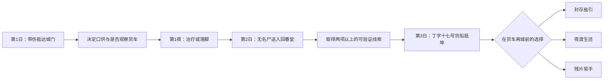

> 2026-09-05 实现更新：六十日完整篇已接续原序章，采用 19 个关键事件、五类行为路线与独立终局。当前规则和验收范围见 [六十日完整篇实施与验收](青石江湖-六十日完整篇实施与验收.md)；下文保留为设计素材，未来 AI 等旧设想不属于当前离线单机范围。

# 《青石江湖》最小完整剧情设计：雨夜盐引

> 定位：可独立游玩的 Demo 序章；游戏内第 1—3 日；预计 18—25 分钟。  
> 叙事边界：结清“程守义遇害与城门私放货车”这一小案，不提前结清丁字十七盐案、乌鳞散来源和三方阴谋。

> 第九阶段收尾补充（2026-09-04）：结局 A“封存盐引”、B“夜渡生还”、C“残片易手”均已由有限选项、规则层和 v6 存档支持。货船沿用距开场40小时、第三日09:00抵埠，货车在距开场46小时、第三日15:00离城；最后交存必须严格早于15:00。假名登记、拘押复核、医馆保密/再授权、轻经济和两棵早期技能树均已接入。乔五仍不正式登场，河岸中人未具名且只知道残片相关信息；第四日入口仍显示但禁用。18—25分钟仅为设计目标，尚未做真人计时或浏览器视觉试玩。详见[第九阶段报告](./青石江湖-第九阶段全量回归与文档收尾报告.md)。

## 1. 要解决的问题

现有第一、二日内容已经能让玩家进城、治伤、发现尸体和取得初步关联，但缺少高潮、裁决和结尾。本设计把第 3 日“丁字十七号货船抵埠”收束为一次有限的查验行动：玩家必须在货车出城前决定交出、保留或放弃证据。无论选择何种道路，都会看到一个明确的后果和结尾画面。

这个小案回答三个问题：

1. 荒道袭击针对的不是主角，而是账房程守义；
2. 程守义把盐引残片藏进主角行囊，主角的伤与他的死都和乌鳞散有关；
3. 马三刀收受漕帮钱财，为带有黑鳞蜡痕的货车免检，并将可疑外乡人的消息递了出去。

它不回答“谁伪造盐引、谁控制整条盐路”。县丞许惟谦、乔五和韩百川仍是后续六十日的真相；本案只让玩家抓住其中一段可被当下证实的链条。

## 2. 核心玩法闭环

玩家只需完成一条主线路径即可通关；不同信息和立场会改变可用行动及结局。按每段文本 20—40 秒、调查或选择 15—30 秒计算，主路线应有 16—20 个首次有效节点，才能稳定达到 18—25 分钟。所有结局都保存为普通存档，通关后可选择“结束本次 Demo”或“继续第 4 日”。

## 3. 三日流程

### 第 1 日：活着入城

**目标**：解决进城、伤势和落脚问题，同时留下至少一条可追溯痕迹。

- 城门盘查保留现有真话、半真话、假名、沉默、搜查和拘押分支。
- 玩家可检查行囊取得 `E01 盐引残片`，也可观察免检货车取得 `L03 黑鳞蜡痕/车夫特征`。
- 在回春堂同意检查后，沈砚秋留下 `E05 主角伤口病案`；不治疗也允许继续，只会提高第 2 日风险。
- 客栈登记、城门口供和是否公开提到“丁字十七”均保留为后续可核对的事实，不把它们当成单次成败判定。

### 第 2 日：把尸体变成证据

**固定事件**：河边无名尸送入回春堂。

- 沈砚秋能确认尸体与主角伤口的毒物和兵刃痕迹相近；前提是玩家曾允许检查，或此时补做检查。
- 尸体的算盘珠、商旅名册或玩家的荒道回忆三者之一可确认死者为程守义。三条路径只需实现其中两条，避免把唯一线索压在单一 NPC 身上。
- 沈砚秋不会断言幕后主使，只给出医学结论：两人受同类淬毒刃所伤，程守义死于失血和毒性加重。
- 获得两项有效线索后，沈砚秋提示应由县衙总捕头宁不平查验，解锁县衙；若玩家不愿报案，也会从客栈流言得知第 3 日有挂官盐旗的船靠岸。

有效线索的最小集合为：

| 线索 | 来源 | 能证明什么 |
|---|---|---|
| 盐引残片 | 行囊或搜查后的归还 | 丁字十七与县衙火漆、黑鳞蜡痕有关 |
| 伤痕比对 | 沈砚秋的两次检查 | 主角与程守义遭到同类淬毒兵刃攻击 |
| 货车观察 | 城门 | 有一辆货车以不正常方式免检，并留有同样蜡痕 |
| 身份确认 | 商旅名册、算盘珠或回忆 | 无名尸就是遭袭商旅的账房程守义 |

### 第 3 日：盐引封验

**固定事件**：丁字十七号货船抵埠。货船必然抵埠；玩家只能改变一辆转运货车和城门记录是否被及时封存。

1. 码头卸货时，玩家凭货车观察、残片或传闻认出同一名车夫与黑鳞蜡痕。
2. 玩家可跟踪货车、请沈砚秋写下伤痕说明，或直接带证据找宁不平。
3. 宁不平只在玩家持有两项以上有效线索时同意临时封验；线索不足时，他会记录口供，但不会为陌生人强行截停官盐车。
4. 封验现场以文书编号、火漆、车门蜡痕和马三刀的放行记录交叉核对。马三刀的罪责是收钱免检、递出消息和试图毁掉放行簿；他不是全案主谋。
5. 马三刀被带走或货车离城后，立即进入结局，不要求玩家继续追逐整条私盐链。

## 4. 三个完整结局

### 结局 A：封存盐引（查验成功）

**条件**：两项以上有效线索；向宁不平报案；在货车出城前完成封验。

宁不平封存残片、病案副本和放行簿，扣下货车与马三刀。马三刀承认收钱放行、将“带伤且提过丁字十七的外乡人”递话给码头，却不知道账房已把残片藏入行囊。货车中只查到部分可疑货物，真正的大头已经随别路转走。

**结尾画面**：宁不平给主角一张三日内有效的暂留凭条。夜里有人在县衙外看见封存箱被转移的方向；主角知道案子没有结束，但自己已经不再只是无名受害者。

### 结局 B：夜渡生还（主动离县）

**条件**：已确认程守义身份，或已确认主角与尸体的危险伤痕关联；拒绝报案并在货车离城后从河岸夜渡离开青石。

玩家保留或销毁残片，避开城门，从商旅小船离县。马三刀与货车照常完成交易，程守义被官方写成身份不明的可疑死者。

**结尾画面**：船离开青石河弯，主角摸到尚未散尽的药味，意识到自己选择的是生还而非清白。后续若继续游历，残片、旧口供和追踪风险照常产生回声。

### 结局 C：残片易手（错误或交易）

**条件**：实际持有残片，且苏晚棠实际见过残片或马三刀实际递话；接受河岸未具名中人口信，并在货车离城后交物。

残片离开玩家控制，货车照常离城。宁不平只能以无名尸和零散传闻留存；玩家得到一次性的暂时通行承诺，而非银钱、清白或长期保护。

**结尾画面**：夜雨洗掉车辙，玩家手里的东西换成了钱或通行口信。程守义的名字仍无人写进案卷，这个结果明确显示了交易与急于求生的代价。

## 5. 最小实现范围

必须新做的内容只有：县衙/宁不平的报案与封验场景、第 3 日货船和货车倒计时事件、三种结局画面及其存档终态。城门、客栈、医馆、尸体、伤痕比对和基础存档应复用现有实现与已通过的基线测试。

首版不做：乔五正式登场、码头自由探索、战斗、假名全分支、贫困杂活、完整五维关系、跟踪系统、成长系统，以及第 4 日以后的内容。它们在通关体验已成立后再扩展。

建议只新增以下规则状态：

| 状态 | 用途 |
|---|---|
| `chengShouyiIdentified` | 无名尸是否被合理确认身份 |
| `poisonWoundLinked` | 主角与尸体是否完成伤痕比对 |
| `cartMarkObserved` | 是否观察到免检车和黑鳞蜡痕 |
| `evidenceCustody` | 残片在主角、县衙、漕帮或已毁之间的归属 |
| `day3CargoStatus` | 未抵埠、卸货中、已封验、已离城 |
| `prologueEnding` | A、B、C 或空，决定结尾展示与第 4 日起点 |

## 6. 验收标准

1. 不接入 AI、只用有限选项，也能在 18—25 分钟内抵达一个结局；首次主线包含 16—20 个有效节点。
2. 每条通关路线至少有 8 次会改变信息、风险、资源或结局资格的决定。
3. 结局 A 需要两项不同来源的可验证线索；单句指控、单一残片或 NPC 的主观猜测不能直接抓人。
4. 玩家未参与时，第 3 日货船仍抵埠、货车仍离城；世界事件不等待玩家。
5. 每个结局都显示：程守义的已知结论、残片归属、马三刀和货车的结果、主角下一个处境。
6. 通关后保存可继续进入第 4 日，也可在结局画面结束本次 Demo；两种操作均不改写结局事实。

## 7. 后续扩展顺序

先完成结局 A 的唯一主线路径并测试通关，再补 B、C；之后才将拘押复核、假名登记、贫困兜底、交易/跟踪、关系和成长拆成可回收的扩展路线。这样每新增一组分支都建立在一段已经有开端、高潮和结尾的可玩内容上。

