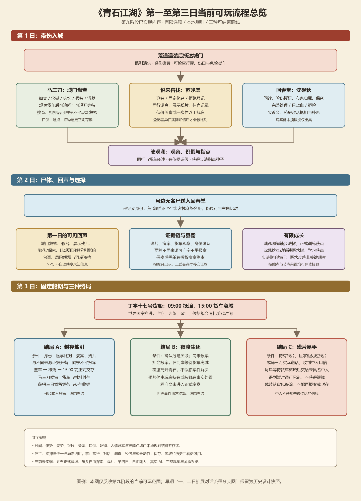
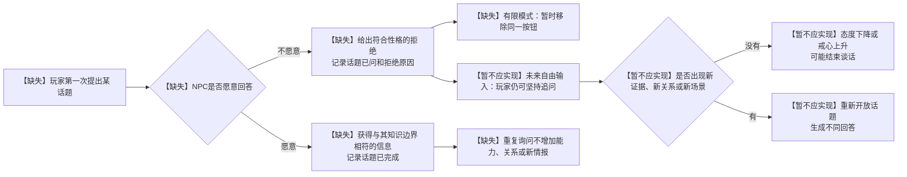

# 《青石江湖》第一、二日扩展对话流程分支图

> 文档性质：已确认的下一阶段设计基线，不代表以下内容已经全部实现。  
> 最近更新：2026-09-04  
> 目标：在保持轻经济压力的前提下，增加有效对话选择、NPC记忆、关系变化和第二日回声。  
> 范围：八名核心 NPC 全部纳入说明；岳寒声遵守世界时间线，第一、二日不可接触，不为凑人数提前登场。
> 关联文档：[产品需求文档](./青石江湖-单机版产品需求文档.md)、[世界观与剧情设计](./青石江湖-世界观与剧情设计.md)、[主角视角六十日详细剧情设计](./青石江湖-主角视角六十日详细剧情设计.md)

> 第三阶段补充（2026-09-04）：下图与159项审计表保留第二阶段快照。现已增加五维关系、通用话题锁定、结构化口供与证物记忆；SU_NAME_LOCK、LU_NAME1 的锁定改由通用系统承接，SU2_NAME2／SU2_SURNAME 的称呼重开已有现有住宿路线支撑。LU2_NAME2／LU2_SURNAME 仅规则条件具备，获得额外信任的守约剧情仍缺失。SU_TRUE_NAME 仍没有独立真名选择页，只在现有自动登记住宿时增加一次信任。MA2_CONFLICT、SHEN_LIE、LU_LIE 等不能因有矛盾接口就标成剧情已完成。最新差异和第一日缺口见[第三阶段验收报告](./青石江湖-第三阶段NPC关系记忆基础验收报告.md)。

## 第九阶段当前可玩流程总览

> 本图对应当前可玩的有限选项范围：从第一日入城到第三日三种结局，并标出轻经济和技能树的实际作用。原有第一、二日大图及159项审计表继续保留为历史设计快照。

## 历史设计图例

> 第五阶段补充（2026-09-04）：下方大图及159项表仍为第二阶段历史快照，不覆盖为“全部完成”。第一日已新增失忆/混乱口供、货车追问、退开重入、现场复核；独立真名/假名/拒登、同行调查、展示残片；陆观澜姿势种子/有依据识假/旁听；医馆问诊、授权、布条自留/交回、只止血、拒检重开、保密再授权。当前新增状态及实际流程图以[第五阶段验收报告](./青石江湖-第五阶段第一日内容扩展验收报告.md)为准。复核是宁不平到城门读记录，不代表县衙散线开放。经济兑换、成长及第二日系统回声仍延后，不能把图中这些设计节点误标为实现。

> 第九阶段收尾补充（2026-09-04）：第六至第八阶段已补齐第二日四类回声、结局B/C、轻经济和步法/医术早期树。下方节点标签仍保留历史快照，不能用其中“缺失”反推当前代码范围；当前可玩状态以第九阶段报告的有界路线为准。未实现的仍包括乔五正式登场、码头自由探索、战斗、第四日、自由输入与完整武学/师承系统。

- `态度`：NPC对玩家的直观情绪，影响是否愿意继续交谈。
- `信任`：NPC是否相信玩家，并愿意承担风险提供帮助。
- `戒心`：NPC是否怀疑玩家套话、撒谎或另有目的。
- `敌意`：达到一定程度后可能拒绝服务、搜查、拘捕、跟踪或伏击。
- `人情`：一方实际帮助另一方后形成，不能靠重复对话刷取。
- `记忆`：记录玩家说过什么、展示过什么、是否前后矛盾，以及某个话题是否已经问过。
- 虚线表示设计上存在影响，但当前阶段不能直接与该 NPC 对话。

## 第一、二日总对话分支图

```mermaid
flowchart TB
    START["【已实现】第一日傍晚<br/>主角负伤抵达青石县城门<br/>路引遗失，同行者失散"] --> MA_OPEN

    subgraph D1_GATE["【缺失】第一日：城门盘查／马三刀"]
        MA_OPEN["【已实现】马三刀：路引拿出来<br/>哪里人，来做什么"]

        MA_OPEN --> MA_TRUE["【已实现】如实说遇袭<br/>记忆：遇袭口供<br/>可信度受口才与疲劳影响"]
        MA_OPEN --> MA_HALF["【已实现】只说路引遗失<br/>记忆：含糊口供<br/>戒心上升"]
        MA_OPEN --> MA_FORGET["【缺失】声称失忆、记不清籍贯<br/>戒心上升<br/>伤势使说法略有可信度"]
        MA_OPEN --> MA_NAME["【已实现】反问差役姓名<br/>确认马三刀身份<br/>他仍要求回答盘问"]
        MA_OPEN --> MA_SILENT["【已实现】保持沉默<br/>戒心明显上升<br/>同僚靠近"]
        MA_OPEN --> D1_INSPECT

        D1_INSPECT{"【缺失】先自行观察"}
        D1_INSPECT --> D1_WOUND["【已实现】检查伤口<br/>只知创口浅却持续渗血"]
        D1_INSPECT --> D1_BAG["【已实现】检查行囊<br/>发现丁字十七残片"]
        D1_INSPECT --> D1_GATE_OBS["【缺失】观察城门<br/>发现普通行旅严查<br/>油布货车快速放行"]

        MA_TRUE --> MA_TALK
        MA_HALF --> MA_TALK
        MA_FORGET --> MA_TALK
        MA_NAME --> MA_TALK
        MA_SILENT --> MA_TALK
        D1_WOUND --> MA_OPEN
        D1_BAG --> MA_OPEN
        D1_GATE_OBS --> MA_OPEN

        MA_TALK["【已实现】第二轮盘问<br/>根据已知信息递进显示话题"]
        MA_TALK --> MA_INN["【已实现】询问投宿<br/>解锁悦来客栈"]
        MA_TALK --> MA_CLINIC["【已实现】说明伤势或询问求医<br/>解锁回春堂"]
        MA_TALK --> MA_CART["【缺失】追问免检货车<br/>马三刀用漕运关防搪塞<br/>戒心小幅上升"]
        MA_TALK --> MA_DING["【已实现】提起丁字十七<br/>马三刀表面否认<br/>戒心上升并向漕帮递话"]
        MA_TALK --> MA_BRIBE["【缺失】试探通融<br/>同僚在场时公开拒绝<br/>若稍后出现私下场景才可能谈条件"]
        MA_TALK --> MA_SEARCH_OFFER["【缺失】主动提出接受搜查<br/>降低口头冲突<br/>但残片可能暴露"]
        MA_TALK --> MA_CHALLENGE["【已实现】质问或威胁<br/>戒心、敌意上升<br/>差役准备强制搜查"]
        MA_TALK --> MA_WITHDRAW["【缺失】暂时退到一旁<br/>花费时间观察他人通关<br/>伤势与疲劳继续发展"]

        MA_INN --> MA_DECIDE
        MA_CLINIC --> MA_DECIDE
        MA_CART --> MA_DECIDE
        MA_DING --> MA_DECIDE
        MA_BRIBE --> MA_DECIDE
        MA_SEARCH_OFFER --> MA_SEARCH
        MA_CHALLENGE --> MA_DECIDE
        MA_WITHDRAW --> MA_TALK

        MA_DECIDE{"【已实现】请求入城时<br/>戒心是否达到搜查阈值"}
        MA_DECIDE -->|未达到| GATE_PASS["【已实现】获准入城<br/>保留第一份口供记录"]
        MA_DECIDE -->|达到| MA_SEARCH["【已实现】强制搜查"]
        MA_SEARCH -->|没有发现残片| GATE_PASS
        MA_SEARCH -->|发现残片| DETAIN["【缺失】被扣留<br/>残片进入官面视野<br/>开启拘押而非随机死亡分支"]
    end

    GATE_PASS --> D1_MAP{"【已实现】玩家已知地点"}
    D1_MAP -->|问过投宿| SU_ENTRY
    D1_MAP -->|问过求医| SHEN_ENTRY
    D1_MAP -->|同时知道两处| D1_CHOICE["【已实现】时间有限<br/>玩家自行决定先后顺序"]
    D1_CHOICE --> SU_ENTRY
    D1_CHOICE --> SHEN_ENTRY

    subgraph D1_INN["【缺失】第一日：悦来客栈／苏晚棠与陆观澜"]
        SU_ENTRY["【已实现】柜台后的青衣女子<br/>初见只显示外貌和行为"] --> SU_NEED{"【已实现】玩家先表达需求"}
        SU_NEED --> SU_ROOM["【已实现】询问房间与价格<br/>确认她是掌柜"]
        SU_NEED --> SU_CHEAP["【缺失】请求便宜房间或以工抵宿<br/>经济压力只形成轻微取舍"]
        SU_NEED --> SU_COMPANION["【缺失】描述失散同行者<br/>记录人物特征<br/>她只回答自己见过的客人"]
        SU_NEED --> SU_NAME1["【已实现】第一次询问姓名<br/>她婉拒<br/>记忆：姓名话题已问"]
        SU_NEED --> SU_FRAGMENT["【缺失】试探公文残片<br/>若直接展示则她戒心上升<br/>不会立刻承认知道丁十七"]
        SU_NEED --> SU_OBS["【已实现】观察算盘、住客与出入口<br/>只获得现场信息"]

        SU_NAME1 --> SU_NAME_LOCK["【已实现】有限模式暂时移除姓名选项<br/>自由输入继续逼问则态度下降、戒心上升"]
        SU_ROOM --> SU_REGISTER{"【缺失】登记住宿"}
        SU_CHEAP -->|愿意做一次杂活| SU_WORK["【缺失】少量收入或抵房钱<br/>耗时并增加疲劳<br/>当日不可重复刷"]
        SU_CHEAP -->|不愿劳动| SU_NEED
        SU_REGISTER -->|使用真名| SU_TRUE_NAME["【缺失】留下真实住宿记录<br/>信任略升"]
        SU_REGISTER -->|使用假名| SU_FALSE_NAME["【缺失】留下玩家主张<br/>日后核对可能产生矛盾"]
        SU_REGISTER -->|拒绝登记| SU_NO_ROOM["【缺失】不能正常入住<br/>可另寻办法"]
        SU_TRUE_NAME --> SU_REST
        SU_FALSE_NAME --> SU_REST
        SU_WORK --> SU_REST
        SU_REST["【已实现】住宿一夜<br/>少量银钱支出<br/>恢复疲劳并推进到第二日"]

        SU_ENTRY --> LU_ENTRY["【已实现】可切换观察临窗负剑客"]
        LU_ENTRY --> LU_NAME1["【已实现】询问姓名<br/>陆观澜用玩笑回避<br/>姓名话题暂时锁定"]
        LU_ENTRY --> LU_COMPANION["【缺失】询问失散同行者<br/>他只说自己实际见过的情况"]
        LU_ENTRY --> LU_CART["【缺失】谈城门免检货车<br/>若玩家观察过货车<br/>他会反问玩家为何在意"]
        LU_ENTRY --> LU_STANCE["【缺失】请他点评持剑姿势<br/>开启一次基础指点机会<br/>不是立即获得高级功法"]
        LU_ENTRY --> LU_LIE["【缺失】故意说假话试探<br/>若被识破则信任下降<br/>他可能反过来提供半真消息"]
        LU_ENTRY --> LU_SILENT["【缺失】不主动搭话，坐在附近听酒客交谈<br/>耗时但风险较低"]
    end

    subgraph D1_CLINIC["【缺失】第一日：回春堂／沈砚秋"]
        SHEN_ENTRY["【已实现】右手微颤的医者<br/>初见未知姓名"] --> SHEN_ASK["【缺失】沈砚秋主动询问<br/>伤口由什么兵器造成"]
        SHEN_ASK --> SHEN_TRUE["【缺失】如实描述袭击<br/>记忆：真实伤情陈述<br/>信任略升"]
        SHEN_ASK --> SHEN_LIE["【缺失】谎称意外划伤<br/>记忆：伤情口供<br/>与后续证据冲突会降低信任"]
        SHEN_ASK --> SHEN_REFUSE["【缺失】拒绝说明<br/>不直接惩罚<br/>医生只按可见伤情处理"]
        SHEN_ASK --> SHEN_COUNTER["【缺失】反问他为何在意<br/>他说明出血速度异常<br/>不提前泄露毒物名称"]

        SHEN_TRUE --> SHEN_CONSENT
        SHEN_LIE --> SHEN_CONSENT
        SHEN_REFUSE --> SHEN_CONSENT
        SHEN_COUNTER --> SHEN_CONSENT

        SHEN_CONSENT{"【缺失】是否允许检查和保存染血布条"}
        SHEN_CONSENT -->|允许完整检查| SHEN_PAY{"【已实现】是否支付得起普通诊金"}
        SHEN_CONSENT -->|只允许止血| SHEN_BASIC["【缺失】只做基础包扎<br/>伤势未根治<br/>医生没有足够依据比对毒物"]
        SHEN_CONSENT -->|拒绝检查| SHEN_LEAVE["【缺失】保留秘密<br/>伤势继续恶化"]

        SHEN_PAY -->|支付| SHEN_TREAT["【已实现】完成治疗<br/>记录异常苦味<br/>确认沈砚秋姓名与身份"]
        SHEN_PAY -->|银钱不足| SHEN_DEBT["【缺失】先止血并留下人情债<br/>或允许一次药房杂活抵部分诊金<br/>不形成高压经济软锁"]
        SHEN_TREAT --> SHEN_SECRET["【缺失】可请求医生保密<br/>是否答应取决于玩家态度与医者原则"]
        SHEN_TREAT --> SHEN_SHOW_FRAGMENT["【缺失】可展示残片苦味<br/>医生只能判断气味可能相关<br/>不知道盐运幕后关系"]
    end

    SU_REST --> DAY2
    SHEN_TREAT --> TIME_ADVANCE["【已实现】继续旅行、交谈或另寻住处"]
    SHEN_DEBT --> TIME_ADVANCE
    SHEN_BASIC --> TIME_ADVANCE
    TIME_ADVANCE -->|距开场达到十二小时| DAY2
    DETAIN --> DAY2_DETAIN["【缺失】第二日从拘押状态开始<br/>由宁不平复核口供<br/>不是强迫读档"]

    subgraph D2_EVENT["【已实现】第二日固定事件"]
        DAY2["【缺失】天亮前<br/>河边发现程守义的无名尸<br/>随后送往回春堂"]
        DAY2 --> HIDDEN["【已实现】玩家未目击、未听闻时<br/>只写入隐藏世界状态"]
    end

    DAY2 --> D2_SOURCE{"【已实现】玩家从哪里获知消息"}
    D2_SOURCE --> SU2_ENTRY
    D2_SOURCE --> LU2_ENTRY
    D2_SOURCE --> SHEN2_ENTRY
    D2_SOURCE --> MA2_ENTRY
    D2_SOURCE --> IGNORE2["【缺失】暂不调查<br/>可以休息、挣钱、练习或寻找离城方法<br/>世界事件继续发展"]

    subgraph D2_INN["【缺失】第二日：客栈回声"]
        SU2_ENTRY["【已实现】与苏晚棠交谈"] --> SU2_RUMOR["【已实现】打听近日见闻<br/>得知无名尸被送往回春堂"]
        SU2_ENTRY --> SU2_RECORD{"【缺失】第一日住宿记录"}
        SU2_RECORD -->|真名登记| SU2_TRUE["【缺失】她使用登记姓名称呼玩家<br/>态度较自然"]
        SU2_RECORD -->|假名登记且出现矛盾| SU2_FALSE["【缺失】她不立即揭穿<br/>戒心上升并记住矛盾"]
        SU2_ENTRY --> SU2_NAME2{"【缺失】是否尊重过第一次拒绝<br/>且信任已经提高"}
        SU2_NAME2 -->|满足| SU2_SURNAME["【缺失】她主动允许称呼苏掌柜<br/>仍不透露抄账秘密"]
        SU2_NAME2 -->|不满足并继续逼问| SU2_ANNOY["【缺失】态度下降<br/>结束姓名话题或暂时结束交谈"]
        SU2_ENTRY --> SU2_WARN{"【缺失】第一日是否暴露丁字十七<br/>且苏晚棠对玩家有基本信任"}
        SU2_WARN -->|是| SU2_TAIL["【缺失】她含蓄提醒<br/>昨夜有人打听玩家行踪"]
        SU2_WARN -->|否| SU2_NONE["【已实现】不提供无依据警告"]

        LU2_ENTRY["【已实现】与陆观澜交谈"] --> LU2_RUMOR["【已实现】询问无名尸<br/>他说明消息来自酒客<br/>不把推测说成事实"]
        LU2_ENTRY --> LU2_TAIL["【缺失】若玩家已被跟踪<br/>他可能用反问提醒身后有人"]
        LU2_ENTRY --> LU2_TRAIN["【缺失】若第一日接受过基础点评<br/>可进行一次短暂切磋或步法练习<br/>耗时且增加疲劳"]
        LU2_ENTRY --> LU2_NAME2{"【缺失】是否因坦诚或守约获得信任"}
        LU2_NAME2 -->|满足| LU2_SURNAME["【缺失】允许玩家称他陆兄<br/>只确认姓氏，不公开完整身世"]
        LU2_NAME2 -->|不满足| LU2_JOKE["【缺失】继续以玩笑回避<br/>话题暂时锁定"]
    end

    subgraph D2_CLINIC["【缺失】第二日：医馆与无名尸"]
        SHEN2_ENTRY["【已实现】抵达回春堂<br/>目击沾河泥的担架"] --> SHEN2_CORPSE["【已实现】询问尸体情况<br/>得知创口浅、持续失血、身份物件缺失"]
        SHEN2_CORPSE --> SHEN2_CHECK{"【已实现】沈砚秋是否实际检查过主角伤口"}
        SHEN2_CHECK -->|没有| SHEN2_NO_LINK["【已实现】不能出现两处伤口同源结论<br/>玩家可先接受检查或保持隐瞒"]
        SHEN2_CHECK -->|已经检查| SHEN2_COMPARE["【已实现】请求比对伤口<br/>确认相似苦味与乌鳞散可能性"]
        SHEN2_NO_LINK --> SHEN2_TREAT["【已实现】允许第二日补做检查<br/>或继续拒绝"]
        SHEN2_TREAT -->|接受检查| SHEN2_COMPARE
        SHEN2_TREAT -->|继续拒绝| SHEN2_END["【已实现】只知道尸体情况<br/>保留自身伤情秘密"]
        SHEN2_COMPARE --> SHEN2_CHOICE{"【缺失】得到毒物关联后如何处理"}
        SHEN2_CHOICE --> SHEN2_HELP["【缺失】协助整理病案或验伤<br/>积累医术使用记录与人情<br/>不直接提升等级"]
        SHEN2_CHOICE --> SHEN2_REPORT["【缺失】建议报官<br/>解锁县衙报案路径"]
        SHEN2_CHOICE --> SHEN2_HIDE["【缺失】要求暂时保密<br/>沈砚秋按医者原则判断是否接受"]
        SHEN2_CHOICE --> SHEN2_STEAL["【缺失】试图取走证物<br/>失败会降低信任并引发阻止<br/>成功也留下可追溯风险"]
    end

    subgraph D2_GATE["【缺失】第二日：马三刀回声"]
        MA2_ENTRY["【已实现】再次经过城门或主动找马三刀"] --> MA2_MEMORY{"【缺失】第一日留下什么记录"}
        MA2_MEMORY -->|如实说明且未惹事| MA2_NORMAL["【缺失】他只做简短复核<br/>不会主动讲解案件"]
        MA2_MEMORY -->|前后口供矛盾| MA2_CONFLICT["【缺失】指出矛盾<br/>戒心上升，可能叫来宁不平"]
        MA2_MEMORY -->|公开提过丁字十七| MA2_DENY["【缺失】继续装作不知<br/>但催玩家离开并再次递话"]
        MA2_MEMORY -->|曾被搜出残片| MA2_HOLD["【缺失】维持扣押或移交县衙复核"]
        MA2_ENTRY --> MA2_CORPSE["【缺失】询问无名尸<br/>只有消息已传播到城门后才承认听说<br/>不知道乌鳞散结论"]
    end

    SHEN2_REPORT --> YAMEN_UNLOCK["【缺失】得知可向县衙报案"]
    DAY2_DETAIN --> NING_ENTRY
    MA2_CONFLICT --> NING_ENTRY
    YAMEN_UNLOCK --> NING_ENTRY

    subgraph D2_YAMEN["【缺失】第二日：县衙／宁不平与顾清河"]
        NING_ENTRY["【缺失】宁不平先接触玩家<br/>观察手、眼神和口供"] --> NING_REPORT{"【缺失】玩家如何报案"}
        NING_REPORT --> NING_TRUE["【缺失】如实交代遇袭、伤口和残片<br/>进入正式记录<br/>可信度由证据与前后口供决定"]
        NING_REPORT --> NING_HIDE["【缺失】只报无名尸，不提残片<br/>保留证物<br/>若以后暴露会形成隐瞒记录"]
        NING_REPORT --> NING_LIE["【缺失】伪造身份或来源<br/>只形成玩家主张<br/>被物证推翻会提高戒心"]
        NING_REPORT --> NING_LEAVE["【缺失】拒绝继续回答<br/>可离开或在拘押状态下等待复核"]
        NING_TRUE --> NING_EVIDENCE{"【缺失】是否交出残片"}
        NING_EVIDENCE -->|交出| NING_HAND["【缺失】县衙取得证物<br/>玩家失去控制权<br/>可能获得有限保护"]
        NING_EVIDENCE -->|只展示| NING_SHOW["【缺失】宁不平记录特征<br/>证物仍在玩家手中"]
        NING_EVIDENCE -->|否认持有| NING_KEEP["【缺失】暂时保留证物<br/>日后搜查风险增加"]

        NING_HAND --> GU_ACCESS{"【缺失】证据与口供是否足够重要"}
        NING_SHOW --> GU_ACCESS
        GU_ACCESS -->|不足| NING_END["【缺失】由宁不平继续调查<br/>不能直接见县令"]
        GU_ACCESS -->|足够| GU_ENTRY["【缺失】顾清河进行一次短暂问话<br/>玩家只看到案后文士"]
        GU_ENTRY --> GU_CHOICE{"【缺失】顾清河分别核对事实、主张和证物"}
        GU_CHOICE --> GU_TRUST["【缺失】坦白不确定之处<br/>获得谨慎关注<br/>不等于完全信任官府"]
        GU_CHOICE --> GU_BARGAIN["【缺失】要求保护、路引或赏钱<br/>只有提供实际价值才可能交换"]
        GU_CHOICE --> GU_WITHHOLD["【缺失】拒绝透露关键证物<br/>顾清河不会无证定罪<br/>但会安排观察"]
        GU_CHOICE --> GU_PROVOKE["【缺失】威胁或冒充官差<br/>由宁不平依法处理<br/>可能拘押但不随机处死"]
    end

    MA_DING -. "马三刀递话" .-> QIAO_SIGNAL
    SU2_TAIL --> QIAO_SIGNAL
    LU2_TAIL --> QIAO_SIGNAL

    subgraph D2_DOCK["【缺失】第二日：漕帮接触／乔五"]
        QIAO_SIGNAL["【缺失】乔五得知外乡人可能掌握丁字十七<br/>玩家尚未自动知道乔五身份"] --> QIAO_ROUTE{"【缺失】玩家如何接近漕帮"}
        QIAO_ROUTE --> QIAO_FOLLOW["【缺失】跟踪递话闲汉或免检货车<br/>成功才解锁码头接触点"]
        QIAO_ROUTE --> QIAO_SELL["【缺失】主动放出出售消息的风声<br/>获得少量银钱机会但暴露自己"]
        QIAO_ROUTE --> QIAO_AVOID["【缺失】保持低调<br/>可能只遭远距离观察<br/>不强迫进入漕帮线"]
        QIAO_FOLLOW --> QIAO_ENTRY["【缺失】被脚夫簇拥的壮汉出面试探<br/>初见不显示乔五姓名和香主身份"]
        QIAO_SELL --> QIAO_ENTRY
        QIAO_ENTRY --> QIAO_TALK{"【缺失】乔五询问玩家手里有什么"}
        QIAO_TALK --> QIAO_SHOW["【缺失】展示残片但不交出<br/>提高交易价值和被抢风险"]
        QIAO_TALK --> QIAO_HAND["【缺失】交出或出售残片<br/>获得一次性银钱或短暂安全<br/>失去核心证物"]
        QIAO_TALK --> QIAO_BLUFF["【缺失】声称另有副本或同伴<br/>只形成玩家主张<br/>是否相信取决于证据与口才"]
        QIAO_TALK --> QIAO_REFUSE["【缺失】拒绝交易<br/>乔五不当场无理由杀人<br/>可能安排跟踪或伏击"]
        QIAO_TALK --> QIAO_ASK_NAME["【缺失】询问身份<br/>他只给江湖称呼或让脚夫代答<br/>不自动确认全部经历与阵营"]
    end

    subgraph D2_YUE["【暂不应实现】岳寒声／时间线限制"]
        YUE_LOCK["【缺失】第一、二日不可接触<br/>破庙地点未知<br/>岳寒声第四日负伤藏入破庙"]
        YUE_RULE["【已实现】任何猜名字、猜地点或套话<br/>都不能提前解锁岳寒声"]
        YUE_LOCK --> YUE_RULE
    end

    IGNORE2 --> D2_END
    SU2_RUMOR --> D2_END
    LU2_RUMOR --> D2_END
    SHEN2_END --> D2_END
    SHEN2_HELP --> D2_END
    SHEN2_HIDE --> D2_END
    SHEN2_STEAL --> D2_END
    MA2_NORMAL --> D2_END
    MA2_DENY --> D2_END
    NING_END --> D2_END
    NING_KEEP --> D2_END
    GU_TRUST --> D2_END
    GU_BARGAIN --> D2_END
    GU_WITHHOLD --> D2_END
    QIAO_AVOID --> D2_END
    QIAO_HAND --> D2_END
    QIAO_BLUFF --> D2_END
    QIAO_REFUSE --> D2_END

    D2_END["【缺失】第二日结束状态不是统一答案<br/>由口供、关系、证物、伤势、住宿记录、银钱和是否被跟踪共同组成"]
```

## 重复询问与话题锁定规则

## 第一天对第二天的主要回声

| 第一天选择 | 第二天对话变化 |
|---|---|
| 对马三刀提过“丁字十七” | 马三刀继续否认；漕帮可能派人观察玩家；苏晚棠或陆观澜在满足条件时提醒被跟踪。 |
| 使用真名住宿 | 苏晚棠使用登记姓名称呼玩家；县衙核对时口供较一致。 |
| 使用假名住宿 | 苏晚棠记住矛盾；县衙、城门与住宿簿核对时产生风险。 |
| 尊重苏晚棠拒绝姓名 | 信任提高后，她可能主动允许玩家称呼“苏掌柜”。 |
| 反复逼问苏晚棠姓名 | 态度下降、戒心上升，姓名话题关闭，严重时提前结束交谈。 |
| 允许沈砚秋完整检查伤口 | 第二日询问尸体后可出现“两处伤口比对”。 |
| 拒绝沈砚秋检查 | 第二日只能了解尸体情况，不能直接获得同源毒物结论。 |
| 接受陆观澜的基础点评 | 第二日出现一次切磋或步法练习；只积累成长记录，不立即获得高级功法。 |
| 城门口供前后矛盾 | 第二日马三刀或宁不平会指出矛盾，不能靠重复口才选项抹除。 |
| 搜查时被发现残片 | 第二日从拘押与复核口供开始，形成独立可玩路线。 |
| 完全不调查案件 | 仍可休息、挣钱、练习或尝试离城；无名尸事件继续发展，不判定任务失败。 |

## 第一、二日经济与成长边界

- 经济压力保持轻量：正常开局应足以承担一次治疗和两至三晚普通住宿。
- 银钱不足不会造成软锁，可通过欠账、一次性杂活、基础包扎或风险更高的露宿继续游戏。
- 客栈杂活和药房杂活每天只结算一次，不能反复对话刷银钱。
- 第一天和第二天主要提供“成长机会”和“使用记录”，不应突然让玩家学会高阶功法。
- 陆观澜可以提供基础剑术或步法点评；沈砚秋可以提供止血、辨伤方面的基础经验。
- 顾清河、宁不平、乔五控制的是不同的资源和路线，不能因为关系数值高就越过证据、身份和利益边界。

## 两日结束时允许形成的代表状态

1. 治好伤、正常住宿、与沈砚秋建立初步信任，并确认乌鳞散关联。
2. 隐藏伤势、保留残片、跟踪免检货车，进入漕帮观察名单。
3. 使用假名住宿，没有调查尸体，但避开了县衙正式记录。
4. 向宁不平交出残片，获得有限官面保护，却失去证物控制权。
5. 把残片卖给漕帮，得到一笔钱和短暂安全，同时成为知情风险人物。
6. 因搜查暴露残片而被拘押，第二日从县衙复核口供开始。
7. 什么案件都不调查，只处理伤势、休息、练习并寻找离城办法。

这些状态都属于有效玩法，不设置唯一“正确路线”。

## 第二阶段现有流程审计（2026-09-04）

本表以代码是否具有完整可达流程为准，不以剧情设想或静态NPC数据代替实现。每个节点及分组均标注；复合节点只完成一部分时保守标为“缺失”。“逻辑错误”为审查时状态，已修复的现有部分另列回归后状态；不因此把尚未开发的后续分支改称已实现。

“暂不应实现”指本轮不得提前引入的自由输入/后续角色内容，不是否定长期设计。原图保留规划拓扑；例如反问姓名后仍须回答盘问、医馆治疗同意与住宿登记目前尚无独立多选阶段，均以表内备注为准。

共 159 项（含分组），回归后：已实现 48 项，缺失 106 项，暂不应实现 5 项。

| 节点 | 审查时 | 回归后 | 代码依据／缺口 |
|---|---|---|---|
| START | 已实现 | 已实现 | createInitialGame：开场只知遇袭与身体状态；D09、D15。 |
| D1_GATE | 缺失 | 缺失 | 扩展设计尚无完整动作/条件/状态流转，或只有部分静态/通用行为；本轮不补充。 |
| MA_OPEN | 已实现 | 已实现 | 初始对话逐句阅读，未读完不能点下一轮；D17。 |
| MA_TRUE | 已实现 | 已实现 | 保存遇袭主张与belief；口才/疲劳只影响该值，尚无后续口供复核；D11。 |
| MA_HALF | 已实现 | 已实现 | 记录主张，戒心+1；D11。 |
| MA_FORGET | 缺失 | 缺失 | 没有失忆籍贯选项或对应口供条件。 |
| MA_NAME | 逻辑错误 | 已实现 | 修复只问差役姓名就跳过盘问的问题；自报后仍须回应，姓名按钮不再重复；D11。 |
| MA_SILENT | 已实现 | 已实现 | 现有规则/有限选项可达；参见本轮路线与状态断言。 |
| D1_INSPECT | 缺失 | 缺失 | 伤口、行囊已有；观察城门在后续阶段可达，但图示开场观察总分流未完整实现。 |
| D1_WOUND | 已实现 | 已实现 | 现有规则/有限选项可达；参见本轮路线与状态断言。 |
| D1_BAG | 已实现 | 已实现 | 现有规则/有限选项可达；参见本轮路线与状态断言。 |
| D1_GATE_OBS | 缺失 | 缺失 | observe-gate规则存在并可在后续阶段触发；图中开场即观察的入口仍缺失。 |
| MA_TALK | 已实现 | 已实现 | 现有规则/有限选项可达；参见本轮路线与状态断言。 |
| MA_INN | 已实现 | 已实现 | 现有规则/有限选项可达；参见本轮路线与状态断言。 |
| MA_CLINIC | 已实现 | 已实现 | 现有规则/有限选项可达；参见本轮路线与状态断言。 |
| MA_CART | 缺失 | 缺失 | ma-cart-deflection虽有数据，但没有可点击动作与结算。 |
| MA_DING | 逻辑错误 | 已实现 | 隐藏递话标记与戒心已有；修复公开文本泄露未确认姓名与递话目的；D13。 |
| MA_BRIBE | 逻辑错误 | 缺失 | 修复用交谈轮数冒充私下场景；现阶段只公开拒收，不扣钱。真正私下通融分支仍缺失；D13。 |
| MA_SEARCH_OFFER | 缺失 | 缺失 | 仅被要求搜查后有submit-search，主动提出搜查不存在。 |
| MA_CHALLENGE | 已实现 | 已实现 | 现有规则/有限选项可达；参见本轮路线与状态断言。 |
| MA_WITHDRAW | 缺失 | 缺失 | 城门缺少独立退开/等待选项；不能用重复威胁冒充旁观。 |
| MA_DECIDE | 已实现 | 已实现 | 现有规则/有限选项可达；参见本轮路线与状态断言。 |
| GATE_PASS | 已实现 | 已实现 | 低于戒心3放行，已报的口供保留；未问路时仍可继续问路；D01、D11。 |
| MA_SEARCH | 已实现 | 已实现 | 戒心>=3后请求入城进入搜查；未打开夹层时粗查可能漏过残片，已有残片则查获；D03、D11。 |
| DETAIN | 逻辑错误 | 缺失 | 扣留和禁止行动已实现；修复夺走残片后背包仍持有及地点文本错位。DAY2_DETAIN复核仍缺失，当前是内容断点；D03、D20。 |
| D1_MAP | 已实现 | 已实现 | 现有规则/有限选项可达；参见本轮路线与状态断言。 |
| D1_CHOICE | 已实现 | 已实现 | 现有规则/有限选项可达；参见本轮路线与状态断言。 |
| D1_INN | 缺失 | 缺失 | 扩展设计尚无完整动作/条件/状态流转，或只有部分静态/通用行为；本轮不补充。 |
| SU_ENTRY | 已实现 | 已实现 | 现有规则/有限选项可达；参见本轮路线与状态断言。 |
| SU_NEED | 已实现 | 已实现 | 现有规则/有限选项可达；参见本轮路线与状态断言。 |
| SU_ROOM | 已实现 | 已实现 | 已有request-room确认掌柜身份；补齐与扣费一致的价格文本。 |
| SU_CHEAP | 缺失 | 缺失 | 扩展设计尚无完整动作/条件/状态流转，或只有部分静态/通用行为；本轮不补充。 |
| SU_COMPANION | 缺失 | 缺失 | 扩展设计尚无完整动作/条件/状态流转，或只有部分静态/通用行为；本轮不补充。 |
| SU_NAME1 | 逻辑错误 | 已实现 | 婉拒后将可知拒答记忆写入现有learnedFacts，不引入五维关系；D04。 |
| SU_FRAGMENT | 缺失 | 缺失 | 扩展设计尚无完整动作/条件/状态流转，或只有部分静态/通用行为；本轮不补充。 |
| SU_OBS | 已实现 | 已实现 | 现有规则/有限选项可达；参见本轮路线与状态断言。 |
| SU_NAME_LOCK | 逻辑错误 | 已实现 | 本轮修复有限姓名按钮重复；跨场景/读档不解锁。自由输入后果见FREE，不算已实现；D14、D20。 |
| SU_REGISTER | 缺失 | 缺失 | rest-night自动用角色姓名登记；独立登记选择页/真名假名拒绝三分支缺失。 |
| SU_WORK | 缺失 | 缺失 | 扩展设计尚无完整动作/条件/状态流转，或只有部分静态/通用行为；本轮不补充。 |
| SU_TRUE_NAME | 缺失 | 缺失 | 角色姓名已写住宿记录，但尚无独立真名选择或信任增长。 |
| SU_FALSE_NAME | 缺失 | 缺失 | 扩展设计尚无完整动作/条件/状态流转，或只有部分静态/通用行为；本轮不补充。 |
| SU_NO_ROOM | 缺失 | 缺失 | 扩展设计尚无完整动作/条件/状态流转，或只有部分静态/通用行为；本轮不补充。 |
| SU_REST | 已实现 | 已实现 | 二两、十二小时、疲劳恢复、登记；修复死亡恢复收益和白天住宿也描述天亮的问题；D05、D09。 |
| LU_ENTRY | 已实现 | 已实现 | 现有规则/有限选项可达；参见本轮路线与状态断言。 |
| LU_NAME1 | 逻辑错误 | 已实现 | 已有婉拒并锁定，仍为通用拒答，不宣称个性化玩笑已完成；D10。 |
| LU_COMPANION | 缺失 | 缺失 | 扩展设计尚无完整动作/条件/状态流转，或只有部分静态/通用行为；本轮不补充。 |
| LU_CART | 缺失 | 缺失 | 扩展设计尚无完整动作/条件/状态流转，或只有部分静态/通用行为；本轮不补充。 |
| LU_STANCE | 缺失 | 缺失 | 扩展设计尚无完整动作/条件/状态流转，或只有部分静态/通用行为；本轮不补充。 |
| LU_LIE | 缺失 | 缺失 | 扩展设计尚无完整动作/条件/状态流转，或只有部分静态/通用行为；本轮不补充。 |
| LU_SILENT | 缺失 | 缺失 | 扩展设计尚无完整动作/条件/状态流转，或只有部分静态/通用行为；本轮不补充。 |
| D1_CLINIC | 缺失 | 缺失 | 扩展设计尚无完整动作/条件/状态流转，或只有部分静态/通用行为；本轮不补充。 |
| SHEN_ENTRY | 已实现 | 已实现 | 现有规则/有限选项可达；参见本轮路线与状态断言。 |
| SHEN_ASK | 缺失 | 缺失 | 到医馆没有主动追问兵器及回答状态机。 |
| SHEN_TRUE | 缺失 | 缺失 | 扩展设计尚无完整动作/条件/状态流转，或只有部分静态/通用行为；本轮不补充。 |
| SHEN_LIE | 缺失 | 缺失 | 扩展设计尚无完整动作/条件/状态流转，或只有部分静态/通用行为；本轮不补充。 |
| SHEN_REFUSE | 缺失 | 缺失 | 扩展设计尚无完整动作/条件/状态流转，或只有部分静态/通用行为；本轮不补充。 |
| SHEN_COUNTER | 缺失 | 缺失 | 扩展设计尚无完整动作/条件/状态流转，或只有部分静态/通用行为；本轮不补充。 |
| SHEN_CONSENT | 缺失 | 缺失 | 不存在检查/保留布条/仅止血/拒绝的独立授权选项。 |
| SHEN_PAY | 已实现 | 已实现 | 三两诊金阈值存在；支付与不足都有分支，但不足的兜底治疗未开发；D16。 |
| SHEN_BASIC | 逻辑错误 | 缺失 | 原Mock声称包扎而规则无治疗作用；本轮改为如实提示未处理，不凭文案假装已实现基础止血。基础包扎规则仍缺失；D16。 |
| SHEN_LEAVE | 缺失 | 缺失 | 扩展设计尚无完整动作/条件/状态流转，或只有部分静态/通用行为；本轮不补充。 |
| SHEN_TREAT | 逻辑错误 | 已实现 | 足额请求治疗视为同意检查；伤势/苦味记录已有，修复无依据确认姓名及死亡后治疗复活；D05、D09。 |
| SHEN_DEBT | 缺失 | 缺失 | 欠债、药房工作与贫困兜底均未实现；本轮不修改经济规则。 |
| SHEN_SECRET | 缺失 | 缺失 | 扩展设计尚无完整动作/条件/状态流转，或只有部分静态/通用行为；本轮不补充。 |
| SHEN_SHOW_FRAGMENT | 缺失 | 缺失 | 扩展设计尚无完整动作/条件/状态流转，或只有部分静态/通用行为；本轮不补充。 |
| TIME_ADVANCE | 已实现 | 已实现 | 现有规则/有限选项可达；参见本轮路线与状态断言。 |
| DAY2_DETAIN | 缺失 | 缺失 | 扩展设计尚无完整动作/条件/状态流转，或只有部分静态/通用行为；本轮不补充。 |
| D2_EVENT | 已实现 | 已实现 | 现有规则/有限选项可达；参见本轮路线与状态断言。 |
| DAY2 | 缺失 | 缺失 | 12小时触发无名尸送医已实现；程守义真实身份尚无世界字段/识别链，不把完整图节点视作完成。 |
| HIDDEN | 已实现 | 已实现 | 非医馆现场、无传闻时仅更新triggeredWorldEventIds/outcomes；D12。 |
| D2_SOURCE | 已实现 | 已实现 | 当前可用苏、陆传闻或医馆现场；县衙及城门消息源尚缺失。 |
| IGNORE2 | 缺失 | 缺失 | 可以不问案件而观察/休息/移动；挣钱、练习、离城路线均缺失。 |
| D2_INN | 缺失 | 缺失 | 扩展设计尚无完整动作/条件/状态流转，或只有部分静态/通用行为；本轮不补充。 |
| SU2_ENTRY | 已实现 | 已实现 | 现有规则/有限选项可达；参见本轮路线与状态断言。 |
| SU2_RUMOR | 逻辑错误 | 已实现 | 修复说出回春堂却不解锁地图；D02、D09。 |
| SU2_RECORD | 缺失 | 缺失 | 有住宿原始记录，没有第二日对话读取该记录的分支。 |
| SU2_TRUE | 缺失 | 缺失 | 扩展设计尚无完整动作/条件/状态流转，或只有部分静态/通用行为；本轮不补充。 |
| SU2_FALSE | 缺失 | 缺失 | 扩展设计尚无完整动作/条件/状态流转，或只有部分静态/通用行为；本轮不补充。 |
| SU2_NAME2 | 缺失 | 缺失 | 扩展设计尚无完整动作/条件/状态流转，或只有部分静态/通用行为；本轮不补充。 |
| SU2_SURNAME | 缺失 | 缺失 | 扩展设计尚无完整动作/条件/状态流转，或只有部分静态/通用行为；本轮不补充。 |
| SU2_ANNOY | 缺失 | 缺失 | 扩展设计尚无完整动作/条件/状态流转，或只有部分静态/通用行为；本轮不补充。 |
| SU2_WARN | 缺失 | 缺失 | 扩展设计尚无完整动作/条件/状态流转，或只有部分静态/通用行为；本轮不补充。 |
| SU2_TAIL | 缺失 | 缺失 | 扩展设计尚无完整动作/条件/状态流转，或只有部分静态/通用行为；本轮不补充。 |
| SU2_NONE | 已实现 | 已实现 | 当前不生成跟踪警告，故不泄露无依据风险；其条件系统不算实现。 |
| LU2_ENTRY | 已实现 | 已实现 | 现有规则/有限选项可达；参见本轮路线与状态断言。 |
| LU2_RUMOR | 逻辑错误 | 已实现 | 修复传闻额外捏造落水时间/谋杀推测，明确酒客来源并给出送医地点；D10。 |
| LU2_TAIL | 缺失 | 缺失 | 扩展设计尚无完整动作/条件/状态流转，或只有部分静态/通用行为；本轮不补充。 |
| LU2_TRAIN | 缺失 | 缺失 | 扩展设计尚无完整动作/条件/状态流转，或只有部分静态/通用行为；本轮不补充。 |
| LU2_NAME2 | 缺失 | 缺失 | 扩展设计尚无完整动作/条件/状态流转，或只有部分静态/通用行为；本轮不补充。 |
| LU2_SURNAME | 缺失 | 缺失 | 扩展设计尚无完整动作/条件/状态流转，或只有部分静态/通用行为；本轮不补充。 |
| LU2_JOKE | 缺失 | 缺失 | 未建立跨日信任重开姓名机制；首次婉拒锁定不等于第二日玩笑分支。 |
| D2_CLINIC | 缺失 | 缺失 | 扩展设计尚无完整动作/条件/状态流转，或只有部分静态/通用行为；本轮不补充。 |
| SHEN2_ENTRY | 逻辑错误 | 已实现 | 医馆现场跨阈值也会目击；不反复抬入同一尸体，听闻者不重复播现场送入；D07、D12。 |
| SHEN2_CORPSE | 逻辑错误 | 已实现 | 浅伤失血/无身份物件；修复未自报姓名就身份确认；D10。 |
| SHEN2_CHECK | 已实现 | 已实现 | 只认doctor-wound-residue检查记录，不认自检或玩家自称；D10、D15。 |
| SHEN2_NO_LINK | 已实现 | 已实现 | 无检查时不能比对；尸体知识与主角检查分离；D10。 |
| SHEN2_COMPARE | 逻辑错误 | 已实现 | 同时需要尸体详情和既往检查；修复同一天检查却说昨日；完成后移除；D09、D10。 |
| SHEN2_TREAT | 已实现 | 已实现 | 可选择现有request-treatment补做；不选择可离开，尚无独立拒绝对话；D10。 |
| SHEN2_END | 已实现 | 已实现 | 可只问尸体而不治自己的伤，不获得同源结论；D10。 |
| SHEN2_CHOICE | 缺失 | 缺失 | 扩展设计尚无完整动作/条件/状态流转，或只有部分静态/通用行为；本轮不补充。 |
| SHEN2_HELP | 缺失 | 缺失 | 扩展设计尚无完整动作/条件/状态流转，或只有部分静态/通用行为；本轮不补充。 |
| SHEN2_REPORT | 缺失 | 缺失 | 扩展设计尚无完整动作/条件/状态流转，或只有部分静态/通用行为；本轮不补充。 |
| SHEN2_HIDE | 缺失 | 缺失 | 扩展设计尚无完整动作/条件/状态流转，或只有部分静态/通用行为；本轮不补充。 |
| SHEN2_STEAL | 缺失 | 缺失 | 扩展设计尚无完整动作/条件/状态流转，或只有部分静态/通用行为；本轮不补充。 |
| D2_GATE | 缺失 | 缺失 | 扩展设计尚无完整动作/条件/状态流转，或只有部分静态/通用行为；本轮不补充。 |
| MA2_ENTRY | 已实现 | 已实现 | 可经地图返城门；没有新增第二日专属盘查；D14。 |
| MA2_MEMORY | 缺失 | 缺失 | 第一日戒心/递话/口供字段保留，但第二日回声没有消费这些字段。 |
| MA2_NORMAL | 缺失 | 缺失 | 扩展设计尚无完整动作/条件/状态流转，或只有部分静态/通用行为；本轮不补充。 |
| MA2_CONFLICT | 缺失 | 缺失 | 扩展设计尚无完整动作/条件/状态流转，或只有部分静态/通用行为；本轮不补充。 |
| MA2_DENY | 缺失 | 缺失 | 扩展设计尚无完整动作/条件/状态流转，或只有部分静态/通用行为；本轮不补充。 |
| MA2_HOLD | 缺失 | 缺失 | 扣押状态保留且存读档不绕过；移交县衙复核和第二日推进缺失。 |
| MA2_CORPSE | 缺失 | 缺失 | 扩展设计尚无完整动作/条件/状态流转，或只有部分静态/通用行为；本轮不补充。 |
| YAMEN_UNLOCK | 缺失 | 缺失 | 只有NPC/地点静态定义，缺少正常解锁入口及对应报案、证物、复核结算；本轮不扩写。 |
| D2_YAMEN | 缺失 | 缺失 | 扩展设计尚无完整动作/条件/状态流转，或只有部分静态/通用行为；本轮不补充。 |
| NING_ENTRY | 缺失 | 缺失 | 只有NPC/地点静态定义，缺少正常解锁入口及对应报案、证物、复核结算；本轮不扩写。 |
| NING_REPORT | 缺失 | 缺失 | 只有NPC/地点静态定义，缺少正常解锁入口及对应报案、证物、复核结算；本轮不扩写。 |
| NING_TRUE | 缺失 | 缺失 | 只有NPC/地点静态定义，缺少正常解锁入口及对应报案、证物、复核结算；本轮不扩写。 |
| NING_HIDE | 缺失 | 缺失 | 只有NPC/地点静态定义，缺少正常解锁入口及对应报案、证物、复核结算；本轮不扩写。 |
| NING_LIE | 缺失 | 缺失 | 只有NPC/地点静态定义，缺少正常解锁入口及对应报案、证物、复核结算；本轮不扩写。 |
| NING_LEAVE | 缺失 | 缺失 | 只有NPC/地点静态定义，缺少正常解锁入口及对应报案、证物、复核结算；本轮不扩写。 |
| NING_EVIDENCE | 缺失 | 缺失 | 只有NPC/地点静态定义，缺少正常解锁入口及对应报案、证物、复核结算；本轮不扩写。 |
| NING_HAND | 缺失 | 缺失 | 只有NPC/地点静态定义，缺少正常解锁入口及对应报案、证物、复核结算；本轮不扩写。 |
| NING_SHOW | 缺失 | 缺失 | 只有NPC/地点静态定义，缺少正常解锁入口及对应报案、证物、复核结算；本轮不扩写。 |
| NING_KEEP | 缺失 | 缺失 | 只有NPC/地点静态定义，缺少正常解锁入口及对应报案、证物、复核结算；本轮不扩写。 |
| GU_ACCESS | 缺失 | 缺失 | 只有NPC/地点静态定义，缺少正常解锁入口及对应报案、证物、复核结算；本轮不扩写。 |
| NING_END | 缺失 | 缺失 | 只有NPC/地点静态定义，缺少正常解锁入口及对应报案、证物、复核结算；本轮不扩写。 |
| GU_ENTRY | 缺失 | 缺失 | 只有NPC/地点静态定义，缺少正常解锁入口及对应报案、证物、复核结算；本轮不扩写。 |
| GU_CHOICE | 缺失 | 缺失 | 只有NPC/地点静态定义，缺少正常解锁入口及对应报案、证物、复核结算；本轮不扩写。 |
| GU_TRUST | 缺失 | 缺失 | 只有NPC/地点静态定义，缺少正常解锁入口及对应报案、证物、复核结算；本轮不扩写。 |
| GU_BARGAIN | 缺失 | 缺失 | 只有NPC/地点静态定义，缺少正常解锁入口及对应报案、证物、复核结算；本轮不扩写。 |
| GU_WITHHOLD | 缺失 | 缺失 | 只有NPC/地点静态定义，缺少正常解锁入口及对应报案、证物、复核结算；本轮不扩写。 |
| GU_PROVOKE | 缺失 | 缺失 | 只有NPC/地点静态定义，缺少正常解锁入口及对应报案、证物、复核结算；本轮不扩写。 |
| D2_DOCK | 缺失 | 缺失 | 扩展设计尚无完整动作/条件/状态流转，或只有部分静态/通用行为；本轮不补充。 |
| QIAO_SIGNAL | 缺失 | 缺失 | 仅ma-sandao.informedRiverGang标记；没有乔五收信/追踪状态机。 |
| QIAO_ROUTE | 缺失 | 缺失 | 缺少码头接触、交易/跟踪条件与动作结算；本轮不扩写。 |
| QIAO_FOLLOW | 缺失 | 缺失 | 缺少码头接触、交易/跟踪条件与动作结算；本轮不扩写。 |
| QIAO_SELL | 缺失 | 缺失 | 缺少码头接触、交易/跟踪条件与动作结算；本轮不扩写。 |
| QIAO_AVOID | 缺失 | 缺失 | 不被强制进入码头，但远距离跟踪没有规则，不能视为完整分支。 |
| QIAO_ENTRY | 缺失 | 缺失 | 缺少码头接触、交易/跟踪条件与动作结算；本轮不扩写。 |
| QIAO_TALK | 缺失 | 缺失 | 缺少码头接触、交易/跟踪条件与动作结算；本轮不扩写。 |
| QIAO_SHOW | 缺失 | 缺失 | 缺少码头接触、交易/跟踪条件与动作结算；本轮不扩写。 |
| QIAO_HAND | 缺失 | 缺失 | 缺少码头接触、交易/跟踪条件与动作结算；本轮不扩写。 |
| QIAO_BLUFF | 缺失 | 缺失 | 缺少码头接触、交易/跟踪条件与动作结算；本轮不扩写。 |
| QIAO_REFUSE | 缺失 | 缺失 | 缺少码头接触、交易/跟踪条件与动作结算；本轮不扩写。 |
| QIAO_ASK_NAME | 缺失 | 缺失 | 缺少码头接触、交易/跟踪条件与动作结算；本轮不扩写。 |
| D2_YUE | 暂不应实现 | 暂不应实现 | 不属于第一二日现有有限模式：不得提前登场或恢复自由输入；保留设计，不开发。 |
| YUE_LOCK | 缺失 | 缺失 | 第一二日不可通过正常路线接触已满足；第四日才出现的人物可见性条件尚未实现，不能提前开放破庙。 |
| YUE_RULE | 已实现 | 已实现 | 未知地点移动及异地NPC请求拒绝；D15。 |
| D2_END | 缺失 | 缺失 | 已有伤势/住宿/残片/扣押/检查差异；五维关系、跟踪与全部路线终态缺失。 |
| TOPIC | 缺失 | 缺失 | 已有有限选项，但没有覆盖所有话题的通用阶段状态机。 |
| ANSWER | 缺失 | 缺失 | 仅具体规则分别处理，非通用关系条件判断。 |
| LEARN | 缺失 | 缺失 | 具体线索与姓名有单次解锁；并非所有完成话题均锁定。 |
| REFUSE | 缺失 | 缺失 | 姓名拒答最小记忆已修复；其他情报的次数/原因未实现。 |
| LIMITED | 缺失 | 缺失 | 姓名拒答移除已实现；全话题拒绝锁定尚缺失。 |
| FREE | 暂不应实现 | 暂不应实现 | 不属于第一二日现有有限模式：不得提前登场或恢复自由输入；保留设计，不开发。 |
| CONTEXT | 暂不应实现 | 暂不应实现 | 不属于第一二日现有有限模式：不得提前登场或恢复自由输入；保留设计，不开发。 |
| ANNOY | 暂不应实现 | 暂不应实现 | 不属于第一二日现有有限模式：不得提前登场或恢复自由输入；保留设计，不开发。 |
| REOPEN | 暂不应实现 | 暂不应实现 | 不属于第一二日现有有限模式：不得提前登场或恢复自由输入；保留设计，不开发。 |
| NO_GRIND | 缺失 | 缺失 | 钱、能力、关系不会因普通重复对话增长；D14。仍可能重复听同一句新闻，不算完整话题重开系统。 |
