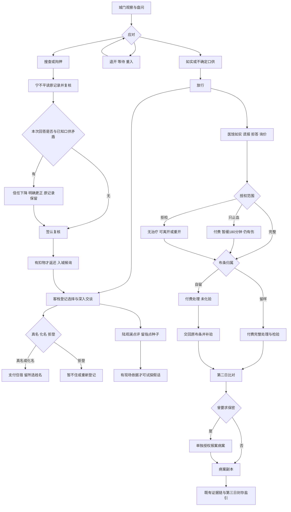

# 第五阶段验收：第一日内容扩展

日期：2026-09-04。

## 结论与验证范围

本阶段规则层、页面共用事件处理与自动化流程测试通过。保留原107项测试，新增13项，总计120/120通过。不是对真实浏览器视觉、原生安装包或真实AI的验收，也不宣称穷尽无限时间组合。

- [x] 城门失忆/混乱口供、货车观察前置、退开/等待/重新接近。
- [x] 搜查或拘押后的宁不平现场复核，口供抄录、矛盾、更正、原物返还。
- [x] 苏晚棠真名/假名/拒登独立选择，同行调查、展示残片和登记记录。
- [x] 陆观澜同行询问、货车转述、剑姿点评、现场识假、旁听。
- [x] 医馆问诊、验伤/布条授权、只止血、拒检/重开、保密/病案再授权。
- [x] 新话题一次性记忆、重复锁定、状态不可变与存读一致。
- [x] 死亡/拘押非法动作拒绝；复核为拘押状态下明确允许的例外。
- [x] 原两条主线和包含新增选择的组合路线均可封存盐引。
- [x] 测试、Lint、TypeScript、Web构建、桌面前端构建。

## 已确认的业务边界

1. 登记、问诊声明、验伤与布条归属选择先于收费服务。明确选择不消耗世界时间；实际交谈、检查、等候、收费处理仍按规则耗时。菜单切换不生成对白、不推进时间、不刷关系。
2. “本名”指开局玩家自报的名字，不揭示失忆前的真实身世。固定化名为“周行”；开局名字恰好为周行时改用“林舟”，不开放自由输入。
3. 城门名字与客栈登记不同先记为待核对线索。苏晚棠不会自动读取城门口供；玩家主动告知第二个名字后，她才记录差异并产生信任-2、戒心+2。该矛盾不是自动判定哪句已被证伪。
4. 复核需等候30分钟、答复10分钟，必要时更正15分钟，再签认20分钟。宁不平明确听到马三刀读出的记录后才获得相应记忆；不存在全局NPC口供自动互通。没有直接犯罪证据时可入城候询，原口供、搜查、疑点及处罚不删除。实际被扣的残片才返还并生成返还记录，没有扣物时不凭空制造物品。
5. 只止血收三两、用时15分钟，完成后暂缓180分钟失血计时，不加气血、不治愈、不提供药性结论。选项一次性锁定；改做完整处理仍另收原有三两，不退款、不赊账。服务过程中死亡仍扣服务费用，但没有成功收益。
6. 完整处理保持三两/35分钟。自留血布时不生成残留物化验结论，也不将玩家的中毒状态提前确认为不明残毒；交回原布条并授权后才补验。留样授权不等于已经完成验伤。
7. 保密使病案副本请求在规则层不可用；完成伤痕比对后，单独授权报案副本才恢复。已经合法交出的文书不被保密请求凭空收回。现阶段没有闲人向医者套取隐私的额外剧情。
8. 剑姿点评仅记录持久化指点种子与陆观澜当场观察。谎称“脚下没晃”只有点评后可选；识破使信任-2、戒心+2，不加属性或功法。货车转述只记口供，不等同于陆观澜亲见证物。

## 新增可玩路线和状态

普通场景保留原有有限选项，另有“深入交谈与其他行动”“登记与深入交谈”“问诊、授权与其他交谈”入口。子菜单最多五个内容选项及一个返回；未读完仍先逐句继续。

| 场景 | 可玩分支 | 可验证后果 |
| --- | --- | --- |
| 城门 | 失忆、混乱籍贯 | 自报姓名与不确定来由入NPC记忆；失忆分支戒心+1；不确定信息不误判矛盾 |
| 城门 | 观察免检货车后追问 | 未观察无选项；马三刀搪塞入情报、戒心+1 |
| 城门 | 退开→等待→重入 | 保留盘问阶段、疑点和话题；时间与伤势正常推进，不算放行 |
| 城门 | 请求复核→确认或否认→更正→签认 | 宁不平获得明确抄录的口供；真实冲突扣信任；原物返还与候询状态保存 |
| 客栈 | 真名、化名、拒登、重新考虑 | 登记方式与名字持久化；拒登不能住宿；付费登记记录使用所选名字 |
| 客栈 | 同行者、展示残片、主动说明城门名字 | 留下调查种子、苏晚棠见过残片记忆和戒心+1；名字差异只在她实际知情后比对 |
| 陆观澜 | 同行者、免检货车、姿势点评、识假、旁听 | 独立口供、话题记忆、指点种子；旁听不伪造现场证据 |
| 医馆 | 如实、谎报、拒答、诊金 | 未验伤的说法均未核验；完整验伤才能以创缘特征识破枯枝假话；拒答不算撒谎 |
| 医馆 | 完整验伤、留布、自留、交回 | 检查授权、实际物品与化验条件区分；保留主线补验入口 |
| 医馆 | 只止血、拒检、重新考虑、离开 | 收费/暂缓/伤势分离；拒检无免费处理，重开不撤销原记录 |
| 医馆 | 保密、副本再授权、请求赊诊 | 报案病案严格受授权约束；赊诊请求被记为拒绝，不产生钱、人情或免费治疗 |

37个新增一次性话题；“询问同行者”分别覆盖苏晚棠与陆观澜，共38组分支矩阵。打开/关闭菜单与重新接近是导航，不计为一次性剧情话题。并非每次选项都强行改变好感；拒答、授权等会记录各自话题和业务状态，无依据时不凭空奖惩关系。

### 新增分支流程摘要

箭头“改做完整”在实际页面需选择“重新考虑，改做完整验伤”；图不表示自动授权或免费治疗。

## 测试路线与结果

| 用例 | 路线/边界 | 结果 |
| --- | --- | --- |
| F01 | 两种不确定口供、退开等待重入、未知补充不误罚 | 通过 |
| F02 | 扣物复核、否认原口供、更正、返还；禁止中途旅行或换人 | 通过 |
| F03 | 三种登记、拒登再考虑、化名付费、主动披露后比对、NPC隔离 | 通过 |
| F04 | 陆观澜当场观察与识假，无武学收益、转述不当亲见 | 通过 |
| F05 | 三种伤情口供、验伤前后证伪、自留与交回原布 | 通过 |
| F06 | 只止血收费、180分钟边界、恢复失血、重复锁、转完整治疗 | 通过 |
| F07 | 拒检重开、保密后阻止副本、另行授权恢复副本 | 通过 |
| F08 | v5与第四阶段v6真实fixture兼容；部分坏字段/未来返还时间拒绝 | 通过 |
| F09 | 38组首次动作/37话题；重复、记忆、存读、死亡和拘押非法输入 | 通过 |
| F10 | 复核或止血中死亡不发收益；零钱不能止血或赊诊换免费治疗 | 通过 |
| F11 | 化名/展示/指点/假话/自留/归还/保密/跨日/读档组合后通关 | 通过 |
| F12 | 搜查未扣物后的复核，不凭空返还、不清空疑点 | 通过 |
| F13 | 菜单零时间零对白、未观察不追问、删除新结构不能冒充旧档 | 通过 |

原107项全部保留。旧路线测试通过真实点击增加问诊/授权/登记前置，不直接注入同意状态；D20更新为允许拘押复核但禁止自由移动，N15以已经完成授权的状态作为服务中死亡前快照。

原主线A现有23个首次有效节点、25次剧情选项操作和5次移动，不计菜单打开关闭及逐句阅读。原主线B仍独立使用商旅名册确认程守义。初始银钱、住宿/完整治疗价格、货船40小时抵埠/46小时离城、证据交存和结局终态未改。

旧D21有界遍历另外验证445条转换，深度3；不将它冒称全状态空间穷举。38组新增分支均从真实选项抵达前置状态，经过页面共用处理函数，逐次检查旧状态未突变及编码/解码完全相等。

## 发现并关闭的问题

- 新增菜单无对白时，阅读索引可能指向末句之外：共用处理函数限制到最新有效索引。
- 新授权不能直接复用旧“自动检查”的结论：自留样本不给化验情报和已确认中毒状态，补验后再恢复。
- 苏晚棠住宿曾固定使用玩家开局名：现按已选登记名保存与记忆，避免系统自动揭穿假名。
- 含糊值与补充内容会被简单不等比较误罚：`unknown`不参与排他值矛盾判断。
- 宁不平现场复核需动态在场及存档校验：仅复核进行中可在城门选择他，不能提前出现或中途切回差役破坏状态。
- 无扣物复核不能复用“残片已返还”文本；已按实际证物归属分别处理。
- NPC听玩家转述货车不能得到“亲见蜡痕”的证据记忆；改记转述口供。
- 开场同行调查不能凭空知道账房细节；使用样貌不全的询问，待原有证据链进一步确认。
- 新结构整体被删除但还留有新话题/物品时，不得当作旧档重置授权与锁定；读取时拒绝。

## 存档与修改文件

保持v6和原存储键，新增`dayOne.schema=1`持久化结构。完整缺少新结构的合法v5/v6旧档只在内存补默认，不直接改写原文件；有旧住宿记录、已检验残留物时按已存在事实承接登记与验伤，不凭空生成新口供。新字段部分损坏交由既有仓库备份回退。

新增：

- `lib/game/day-one.ts`
- `lib/game/day-one-storage.ts`
- `tests/day-one-flow.test.ts`
- `tests/helpers/confirmed-service.ts`
- `tests/fixtures/v6-before-dayone.json`
- 本验收报告。

修改：

- `lib/game/types.ts`、`limited-actions.ts`、`interaction-rules.ts`、`engine.ts`、`flow-controller.ts`
- `lib/game/npc-memory.ts`、`npc-memory-storage.ts`、`storage.ts`、`world.ts`、`prologue.ts`
- `app/page.tsx`
- `tests/game-engine.test.ts`、`day12-flow.test.ts`、`npc-memory.test.ts`、`prologue-flow.test.ts`
- `文档/青石江湖-单机版产品需求文档.md`
- `文档/青石江湖-第一二日扩展对话流程分支图.md`
- `青石江湖-开发阶段计划.txt`

## 明确未实现与下一阶段

- 第六阶段：第二日系统性回声、更多识别/站队路线、夜渡生还与残片易手等其他结局。当前登记差异/同行线索等已可存储，未自动展开新第二日剧情。
- 第七阶段：以工抵宿、价格折让、欠诊金、人情诊疗、药房杂活、收入循环；本阶段只有拒绝赊诊的记录，无经济兑换。
- 第八阶段：指点种子转能力、训练、功法和师承；本阶段无直接成长收益。
- 没有开发县衙/漕帮的散线内容、第四日角色、真实AI、浏览器点击或原生包测试；没有测真人首次体验时长。
- 既有姓名关系重开基础保留，新一次性话题默认不因跨日就重复；真正新证据/许可通过明确补验、再授权等分支处理。
- 非阻断构建提示：本机npm旧`python`配置、Vinext路由静态分类与部分插件耗时提示；没有修改用户全局配置。

第五阶段完成后停止，等待用户确认下一阶段。
