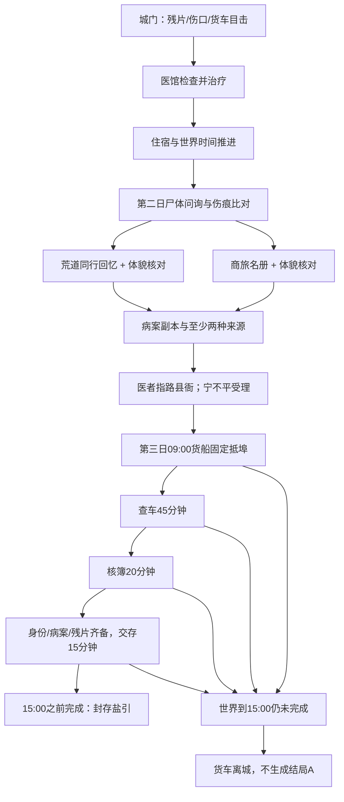

# 第四阶段验收：雨夜盐引·封存盐引

日期：2026-09-04。

## 结论与范围

主线规则与自动化回归通过。只完成“封存盐引”结局A；没有开发夜渡生还、残片易手、完整第一日散分支或第4日剧情。

- 原有89项测试保留，未删除或改写旧断言；新增18项主线用例，总计107/107通过。
- npm run lint：通过。
- npx tsc --noEmit：通过。
- npm run build：通过。
- npm run desktop:build：通过。
- 使用页面共用点击/旅行/退出处理函数、Mock和存档仓库模拟，逐步验证状态不可变与存读一致。没有浏览器点击、Edge扩展、原生安装包、Rust/SQLite实机或真实AI测试。

非阻断提示仍有本机npm的旧python配置警告与Vinext路由静态分类提示。没有修改无关配置。

## 实际可玩路线

### A：荒道回忆确认身份

1. 第一天城门：检查伤口 → 检查行囊 → 观察免检货车 → 如实说明遇袭 → 问医馆 → 问客栈 → 请求入城。
2. 地图前往回春堂，付三两处理伤口；前往客栈，付二两住宿十二小时。
3. 第二天返回回春堂，询问死者 → 比对伤痕 → 细看面容唤起同行回忆 → 请医者写病案副本 → 询问证据该交给谁。
4. 地图前往县衙，佩刀汉子自报宁不平，受理并核验出示的不同来源线索，说明船期与离城时限。
5. 在候事廊候讯三次（单次不超过六时辰），世界到第三日09:00，货船抵埠。候讯不回血、不回疲劳，不改变既定船期。
6. 随宁不平查车45分钟（含往返） → 核对放行簿20分钟 → 正式交存15分钟。
7. 第三日10:20完成“封存盐引”：马三刀带走候审、货车与相关材料封存；玩家取得三日暂留凭条及交存收据。正常路线剩15两，无需刷钱或新经济分支。

该路线有 **19个首次有效选项节点、21次实际选项操作、5次地图移动**。三次候讯只计一个首次节点；不把逐句“继续”、打开地图、查看历史或存档算作有效剧情节点。节点中有超过8次改变信息、风险、资源或结案资格的实际决定。

### B：商旅名册确认身份

同路线A完成尸体问询与伤痕比对后，改去客栈描述左耳旧伤和缺损小指；苏掌柜核对商旅名册，取得程守义身份，再回医馆取病案、问报案去处。此路不要求点击荒道回忆，增加两次地图移动；其后同样能封存结案。

身份两路均有体貌依据，不把传闻或单一名字自动对应到眼前尸体。未实现算盘珠实物第三路。

### 时长目标

19个有效节点落在设计要求的16—20个范围。18—25分钟保留为首次阅读、判断、移动及回看体验目标；本轮未做真人计时，也未强制玩家等待现实时间。自动化毫秒级运行不证明实际玩家时长达标，仍需后续真人节奏验证。

## 规则与剧情闭环

- 两项来源只允许受理和临时查验，不替代完整身份/死因及文书核对。缺少关键材料时，交存结局选项不出现，可在期限内回已有地点补齐。
- 收钱、免检、递消息与毁簿由车号、门钱、放行签押、现场撕簿及分别记录的口供支持。没有把马三刀写成盐案总主谋；未提“丁字十七”的玩家也不会被写成曾主动向他泄密。
- 封存结束才移交残片，普通报案和查验只出示。期限内失败、死亡或未满足条件不发凭条，不删除玩家残片。
- 自己查看物品只增加玩家记录；医者验伤、掌柜核名册、向宁出示证据才写相应NPC记忆。所有结果由本地规则产生，不接受Mock注入世界事实或结局。

## 新增自动化验收清单

全部通过：

| 用例 | 流程与断言 |
|---|---|
| P01 | 完整回忆路线、19节点、第三日通关、交存、凭条、余银、结束投影 |
| P02 | 独立商旅名册路线，不点击荒道回忆也可通关；NPC记忆隔离 |
| P03 | 残片和其蜡痕只算一源；未知县衙不可猜名字前往；不足线索不截车不夺残片 |
| P04 | 两种来源可受理，但缺身份/医学/病案不能直接生成结局 |
| P05 | 无参与时，抵埠前1分钟/到点/离城时刻正确；隐藏消息不进入玩家情报 |
| P06 | 已报案也会错过；读档、反复进出不重置离城期限 |
| P07 | 查车、核簿、交存耗时恰好碰到15:00，各自失败且不假结案 |
| P08 | 14:59完成成功；结局锁定规则、旅行与时间，不重复奖励 |
| P09 | 死亡/拘押阻止结案；交存途中死亡保留残片且无凭条 |
| P10 | 中途/结局自动档与20手动档逐字段往返；坏自动档回退后能继续结案 |
| P11 | 真实v5与第三阶段v6夹具升级；保留关系；部分缺字段和伪造结局拒绝 |
| P12 | 未读完不退出；结束Demo保存失败留在结局，重试成功；第4日禁用 |
| P13 | 异地/未开放结局动作及伪造输入拒绝；初始结局不泄露 |
| P14 | 旅行存档失败不提交到县衙，重试成功默认接待人为宁不平 |
| P15 | 同证据不重复报案；补证重开且不误算口供矛盾 |
| P16 | 医馆同源材料不重复计源；未看旧货车时不虚构以前的观察 |
| P17 | 只知船期时不远程获知实时抵埠，回县衙才收到传讯 |
| P18 | 超过离城时间的旧v6档补成已离城；新档伪造未抵埠被拒绝 |

## 实施中发现并修正的问题

1. **开场按钮挤占**：直接加入观察车会挤掉行囊或残片检查。修为先检查伤口再递进出现；保留六按钮上限与全部原断言。
2. **消息全知风险**：持有计划船期不代表人在客栈也实时收到县衙消息。实时状态限在县衙呈现，其他地方只提示原船期。
3. **补证误算矛盾**：把每次出示的证据集当稳定口供值会产生错误扣信任。改记每次出示事项，不把增加材料判成撒谎；重复同集合锁定。
4. **旧观察冒认**：没有观察过货车时，核验台词不能说“与旧观察一致”。按玩家已有目击记录选择回应。
5. **时间边界和存档倒拨**：判定最后一步完成而非仅点击时间；新档校验货车阶段与世界时间一致，旧档按既定时间补字段。
6. **结局收益仅有文字**：暂留凭条与证物收据已作为真实物品入背包，并保存有效期，不能只在结局写一句“获得”。

## 存档结构与兼容

保持v6主版本、原v5命名的浏览器键及桌面仓库；添加prologueSchema=1。六个要求字段全都持久化，evidenceCustody按残片、病案副本、货车记录、身份材料分别记归属；saltCase保存身份来源、报案与所交来源、查车/核簿、结案时间、凭条有效期。

仅完全没有本阶段字段的合法旧v5/v6档可补默认，不因读取写回旧档。部分新增字段缺失、归属冲突、不完整终态或时间矛盾不能被静默清空。保留既有关系和口供；旧的货车免检概述不被冒充为新蜡痕目击。已错过船期的旧档不会重新获得窗口。

## 修改文件

- lib/game/prologue.ts：新增主线动作、条件、时间、来源核验、证物事务和玩家可见结局投影。
- lib/game/prologue-storage.ts：新增结构校验、旧档安全默认及终态一致性。
- lib/game/types.ts：六项状态、案件记录、新动作/情报/结局物品类型。
- lib/game/engine.ts：时间推进、交互结算、结局冻结及县衙接待人。
- lib/game/interaction-rules.ts、limited-actions.ts：必要动作规则、递进选项、旧动作接入。
- lib/game/world.ts：新增公开证据描述与凭条/收据。
- lib/game/npc-memory-storage.ts、storage.ts：扩展证物白名单和读取校验。
- lib/game/flow-controller.ts：结局出口保存处理及终态旅行禁止。
- lib/ai/mock-service.ts：可观察体貌与医学结论文本。
- app/page.tsx：县衙仅展示宁不平接待、已知船讯、结局及两个入口；保留原纸木视觉和存档面板。
- tests/prologue-flow.test.ts、tests/fixtures/v6-before-prologue.json：新增18条回归与真实旧档夹具。原89条测试文件未修改。
- 文档：本报告、最小完整剧情设计、产品需求文档、根目录开发阶段计划。

## 未实现及停点

夜渡生还/残片易手、拘押复核、假名及第一日散分支、以工抵宿、欠诊金、收入、人情兑换、功法成长、自由输入、码头自由探索和真实AI均未开发。第四日入口按已确认方案禁用。

错过货车只给事实与重开/读档提示，不假称完成另一结局。18—25分钟真人体验时长未验证；原生Windows包、SQLite实机及浏览器视觉未验证。

本阶段到“封存盐引”为止，等待确认下一阶段。
